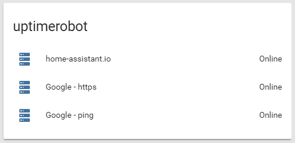

# custom_component to monitor Uptime Robot monitors.


A component which allows you to monitor Uptime Robot monitors. 

To get started:   
Put `/custom_components/sensor/uptimerobot.py` here:  
`<config directory>/custom_components/sensor/uptimerobot.py`  


Example configuration.yaml:  
```yaml
sensor:
  - platform: uptimerobot
    api_key: u432898-d2507e493b31217e6c64fd35
```
**Sample overview:**
  
**In a group**:  
  

[Demo](https://ha-test-uptimerobot.halfdecent.io)

This component is using [https://uptimerobot.com/api](https://uptimerobot.com/api) to get the information.