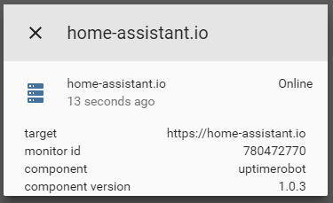

# custom_component to get info about next departures


A component which allows you to get information about next departure from spesified stop. 

To get started:   
Put `/custom_components/sensor/ruter.py` here:  
`<config directory>/custom_components/sensor/ruter.py`  


Example configuration.yaml:  
```yaml
sensor:
  - platform: uptimerobot
    apikey: 'u432898-d2507e493b31217e6c64fd35'
```
 #### Sample overview
  
[Demo](https://ha-test-uptimerobot.halfdecent.io)

This component is using [https://uptimerobot.com/api](https://uptimerobot.com/api) to get the information.